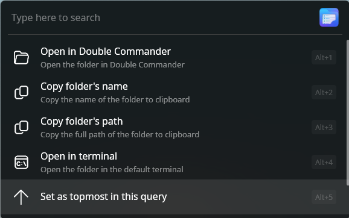
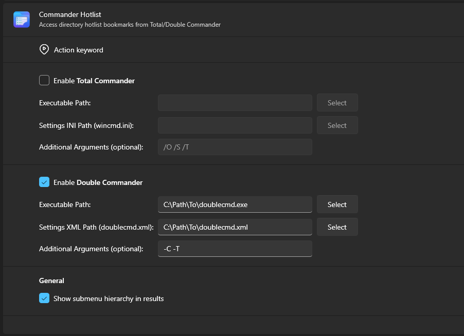
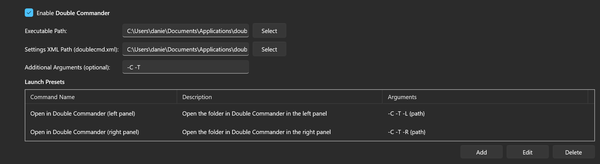
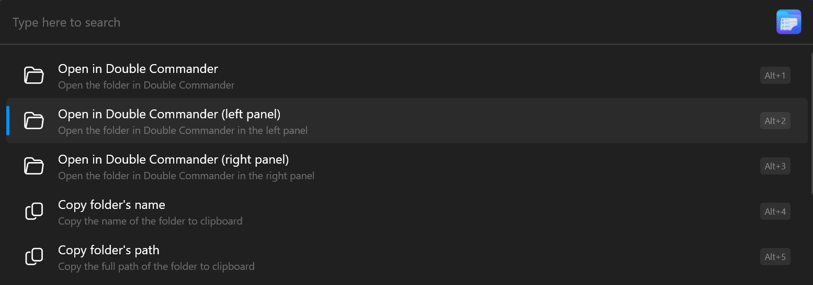

# Commander Hotlist

A [Flow Launcher](https://github.com/Flow-Launcher/Flow.Launcher) plugin that syncs your directory hotlist (bookmarks) from Total Commander and Double Commander, so you can access your favorite folders directly from Flow Launcher.

## Features

- Sync bookmarks from Total Commander's `wincmd.ini` and Double Commander's `doublecmd.xml` files
- Fuzzy search across both bookmark names and folder paths
- Multiple file managers can be enabled at the same time and the bookmarks from all of them show up together
- Context menu actions: copy folder name or path, open in terminal
- Supported file manages: Total Commander and Double Commander. More to be added in the future!

## Usage

First, you'll need to configure your file manager(s) in the plugin settings. Once configured, type the action keyword (default: `ch`) followed by an optional search term to find a bookmarked folder. For example:

- `ch` — lists all your bookmarks from all configured file managers
- `ch proj` — fuzzy-search for bookmarks matching "proj" in their name or path

Selecting an item opens that folder in the file manager where the bookmark comes from. The plugin also provides several context menu actions you can choose from:

- **Open in \<file manager\>** — opens the folder in a different file manager (if you have more than one configured)
- **Copy folder's name** — copies just the folder name to your clipboard
- **Copy folder's path** — copies the full folder path to your clipboard
- **Open in terminal** — opens the folder in the default terminal

### Search behavior

The plugin fuzzy-matches your search term against both the bookmark name and the folder path, then chooses the best match.

## Settings

The settings panel lets you configure Total Commander and Double Commander independently, as well as general settings that affect both of them.

### Total Commander and Double Commander settings

#### Enable

Turns bookmark syncing on or off for the corresponding file manager, allowing them to be displayed in the results.

#### Executable Path

Represents the path of the file manager's executable.

#### Settings INI/XML Path

Represents the path to the settings configuration file that contain the configured bookmarks.

For Total Commander, this file is `wincmd.ini`. For a normal installation, this is usually located in `C:\Users\<username>\AppData\Roaming\GHISLER`. In case of a portable installation, it's usually directly in the TC program folder.

For Double Commander, the settings file is called `doublecmd.xml`. For a normal installation, you'll usually find it in `C:\Users\<username>\AppData\Roaming\doublecmd`, while in case of portable installation, you can find this file in the DC `settings` folder.

#### Additional Arguments

This field is optional and can be left empty. These are custom arguments that will be used, by default, when opening a bookmark. It supports the `{path}` placeholder that will be replaced by the actual path of the bookmark you selected. If this placeholder is not provided, the path will be appended automatically at the end.

Examples (using DC arguments, assuming your selected bookmark is `C:\Path\To\SelectedBookmark`):

- `-C -T` translates to `-C -T C:\Path\To\SelectedBookmark`
- `-R {path} -T` translates to `-R C:\Path\To\SelectedBookmark -T`

You can adjust these arguments according to your preferences, but I would recommend using `/O /S /T` for Total Commander and `-C -T` for Double Commander. This will open your selected bookmark in a new tab of a running instance (if any), using the previously active panel. If no instance is running, it will launch a new instance and open it in a new tab, left panel.

#### Launch Presets

This setting allows you to create additional launch presets with different arguments, which will appear as new context menu options.
As an example, let's say that you set the **Additional Arguments** field (setting described above) to `-C -T`. But you may sometimes want to open a bookmark and force it to appear in the left (`-L {path}`) or right (`-R {path}`) panel. With **Launch Presets** setting, you can create two additional presets and they will appear in the context menu:

 

### General settings

These settings will apply to all configured file manages.

#### Show submenu hierarchy in results

Let's say you have a bookmark called `Word docs` in a nested submenu `Work → Confidential`. This setting will change how bookmarks within submenus are displayed. Keep in mind that the search behavior is also affected:

- If **disabled**, our bookmark would be simply displayed as `Word docs`. Searching for `Confidential` will **NOT** provide a matching result for our example.
- If **enabled**, the submenu names will be added at the beginning of the bookmark name, separated by `>` character, so it would be displayed as `Work > Confindetial > Word docs`. In this case, searching for `Confidential` will provide a match for our bookmark.

## License

MIT